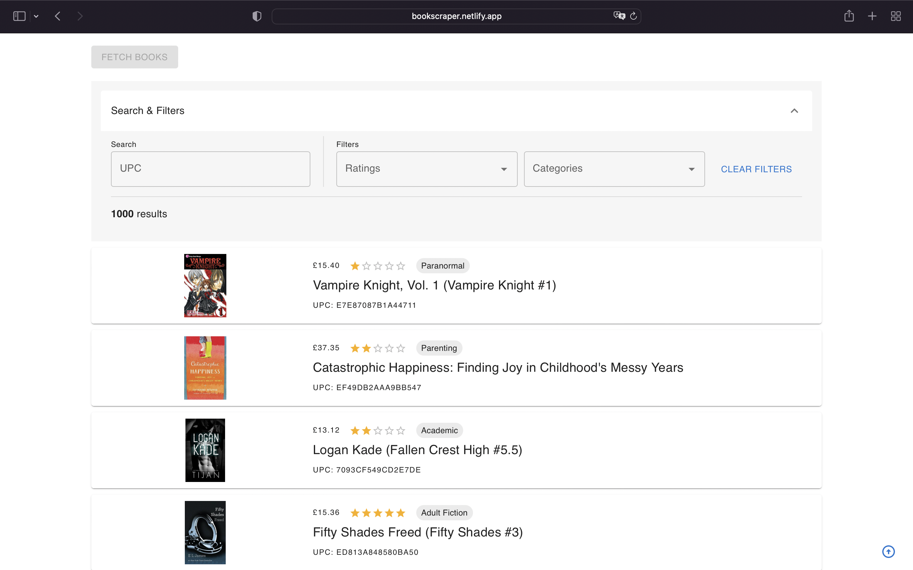

<div id="top"></div>
<h1 align="center">TAMID Bookscraper</h1>

<!-- ABOUT THE PROJECT -->
## About The Project

Link: https://bookscraper.netlify.app/<br>


Instead of creating API endpoints for each search/filter function on the database of books, I decided to first fetch all the books through 1 API endpoint and allow the user to execute the search/filter functions on the frontend. In this manner, UX is better as webscraping is a very time intensive operation. Also, in order to improve UX, the book data is cached in the browser after intial fetch, so that the book data is persistent after reload.

The webscraping was built using NodeJS and a library called puppeteer. I sped up the process by asynchronously opening up a new page for each category link, fetching the book data from each category, and merging the book data from each category into one array of book objects. This is an example of the book schema:<br>
```
{
    "title": "The Art Forger",
    "price": "£40.76",
    "upc": "80cfab6bcff3a244",
    "rating": "Three",
    "image": "http://books.toscrape.com/media/cache/f5/3b/f53bc7b18914c97de7c23967293be119.jpg",
    "category": "Add a comment"
}
```

<p align="right">(<a href="#top">back to top</a>)</p>


### Built With

* [React.js](https://reactjs.org/)
* [Puppeteer](https://devdocs.io/puppeteer/)
* [NodeJS](https://nodejs.dev/)
* [MaterialUI](https://mui.com/)
* [Netlify](https://www.netlify.com/)
* [Google Cloud Functions](https://cloud.google.com/functions)

<p align="right">(<a href="#top">back to top</a>)</p>


<!-- USAGE EXAMPLES -->
## Usage

1. Request data on all the books from https://books.toscrape.com/ by clicking button "Fetch books" (data will be cached in browser)
2. After request is complete, click on "Search & Filter" accordian to reveal several functions
  - Search database of books by UPC
  - Filter database of books by Rating
  - Filter database of books by Category

<p align="right">(<a href="#top">back to top</a>)</p>

<!-- USAGE EXAMPLES -->
## Reflection

If I had additional time, I would work on speeding up the webscraping process by spreading out the work across multiple nodes. Currently, my function only runs on 1 node.

<p align="right">(<a href="#top">back to top</a>)</p>

